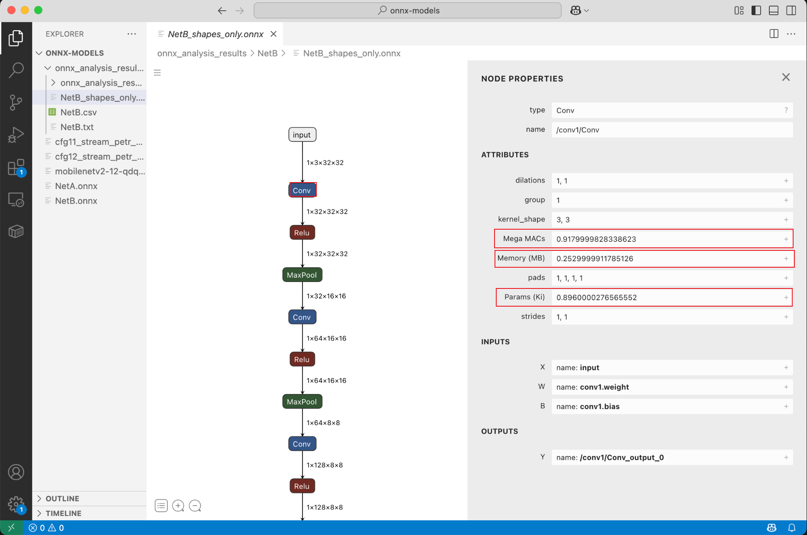
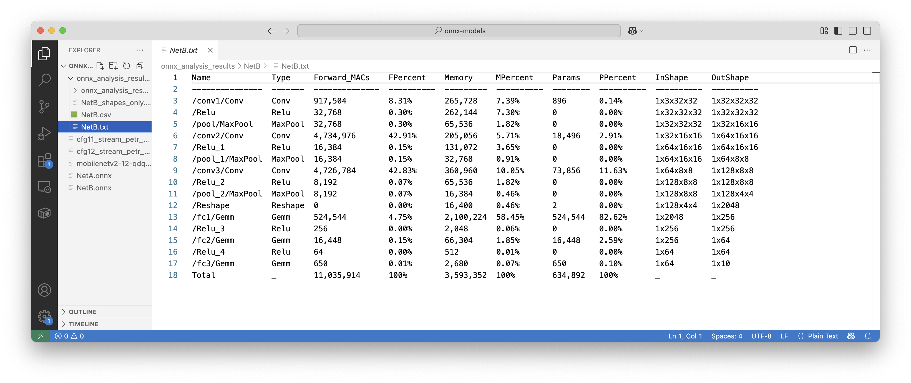
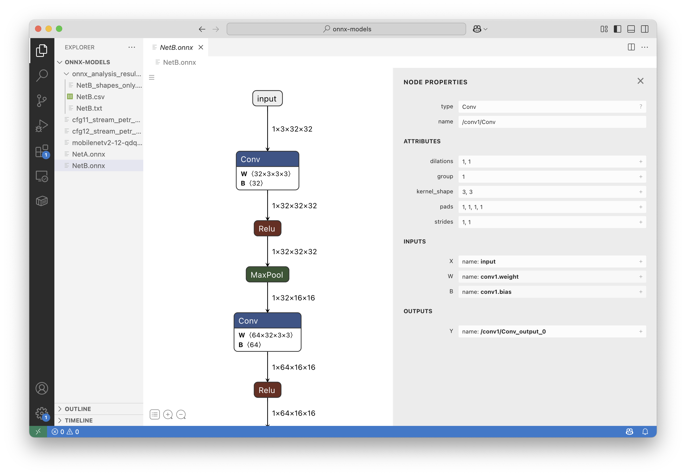

# QTron - ONNX Viewer with Integrated Analysis

A lightweight VS Code extension for viewing and analyzing ONNX models with seamless onnx_tool integration.  
Inspired by [Netron](https://github.com/lutzroeder/netron) and [ONNX Viewer](https://github.com/lijian736/onnx_viewer) but optimized for autoaisys workflows.

Why was this developed?
 * Load Large models faster (we are impatient like that :P); Strip the weights.
 * Profile the ONNX model (lets make our lives simpler).
 * I would like to automate mundane tasks in my life. Thus automated the flow.

NOTE: Loading a model for the first time might take a might more time, but post to which you can happily load the lightweight profiled onnx model.
```
📁 ONNX File →      🚀 strip_and_profile_model() →         👁️ Visualize
     ↓                            ↓                                 ↓
  Original              [Simplify + Analyze]                   Interactive
   Model                          ↓                              Viewer   
                       📦 Weights Stripped              [LightWeight Profiled Model]
                       Profiled for 
                       MAC, Memory, Params (.onnx)             
                       📄 Reports (.txt, .csv)                                                          

```

# Qtron in Action


*Simplified ONNX*


*Layer Wise Profiling Data*


*Simplified ONNX*

## ✨ Key Features

**🎯 One-Click Analysis**: Simply open any `.onnx` file in VS Code
- Automatic model simplification for cleaner visualization
- Integrated onnx_tool profiling with detailed metrics

**📊 Comprehensive Analysis**:
- Layer-wise MAC (Multiply-Accumulate) operations counting
- Parameter count and memory size analysis
- Export to TXT and CSV formats for further processing
- Shape-only ONNX files for efficient analysis

**⚡ Smart Defaults**:
- Results saved next to your ONNX file automatically
- Graceful fallback when advanced tools unavailable
- Configurable through VS Code settings

## 🔧 Configuration

Access settings via VS Code preferences (`qtron.*`):

| Setting | Description | Default |
|---------|-------------|---------|
| `qtron.pythonPath` | Python interpreter path | `"python"` |
| `qtron.enableSimplification` | Enable ONNX simplification | `true` |
| `qtron.enableOnnxToolProfiling` | Enable onnx_tool profiling | `true` |
| `qtron.onnxToolResultsPath` | Analysis results directory | Auto-detected |

## 📁 Analysis Output

When onnx_tool profiling is enabled, you'll get organized results:

```
your_model_directory/
├── your_model.onnx                    # Original model
└── onnx_analysis_results/
    └── your_model/
        ├── your_model_profile.txt      # Human-readable summary
        ├── your_model_profile.csv      # Detailed metrics (Excel-ready)
        └── your_model_shapes_only.onnx # Shape-optimized model
```

## 🔄 Processing Workflow

QTron follows an optimized processing pipeline:

**Integrated Workflow (onnx_tool enabled):**
```
📁 ONNX File →      🚀 strip_and_profile_model()     → 👁️ Visualize
     ↓                        ↓                            ↓
  Original            [Simplify + Analyze]             Interactive
   Model                      ↓                           Viewer                              
                        📄 Reports (.txt, .csv)  [ LightWeight Profiled Model]
                        📦 Weights Stripped/
                        Profiled Model (.onnx)                                                                   

```

**Fallback Workflow (simplification only):**
```
📁 ONNX File → 🔧 Simplify → 👁️ Visualize
     ↓              ↓          ↓
  Original      Simplified  Interactive
   Model         Model      Viewer
```

**Optimization Benefits:**
- ✅ Single-step processing eliminates duplicate simplification
- ✅ Automatic fallback handling for maximum compatibility
- ✅ Preserves original files while generating analysis

## 📦 Installation

1. **From VS Code Marketplace**: Search for 'qtron' and install
2. **Development Build**: 
   ```bash
   git clone <repository>
   cd onnx_viewer
   ./regen.sh
   ```

   ```bash
   # If you are feeling lazy download the .vsix I have genearted
   ```

## 🚀 Usage

1. Open any `.onnx` file in VS Code
2. QTron automatically processes the model:
   - Simplifies for better visualization
   - Runs comprehensive analysis (if available)
   - Opens interactive viewer
3. Find analysis results in `onnx_analysis_results/` directory

## 🔍 Advanced Features

For detailed information about the integration architecture and workflow optimization, see:
- [Processing Flow Diagram](ONNX_PROCESSING_FLOW.md)
- [Architecture Overview](ARCHITECTURE_DIAGRAM.md)
- [Optimization Benefits](OPTIMIZATION_BENEFITS.md) [Optimization Benefits](OPTIMIZATION_BENEFITS.md)

## 💡 Contributing

Have suggestions or found a bug? We'd love to hear from you!
- Open an issue on GitHub
- Submit a pull request
- Try to fix it on your own or ping me on Team and buy me a coffee, we can debug together :P
