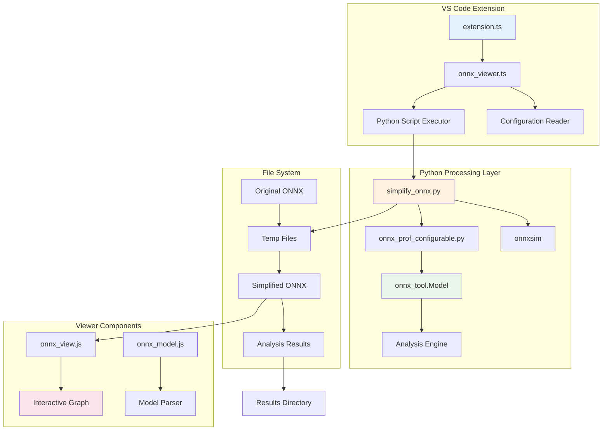
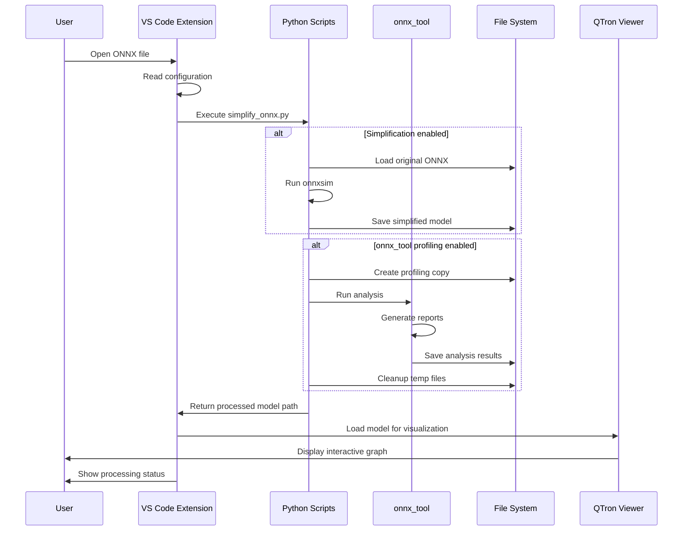
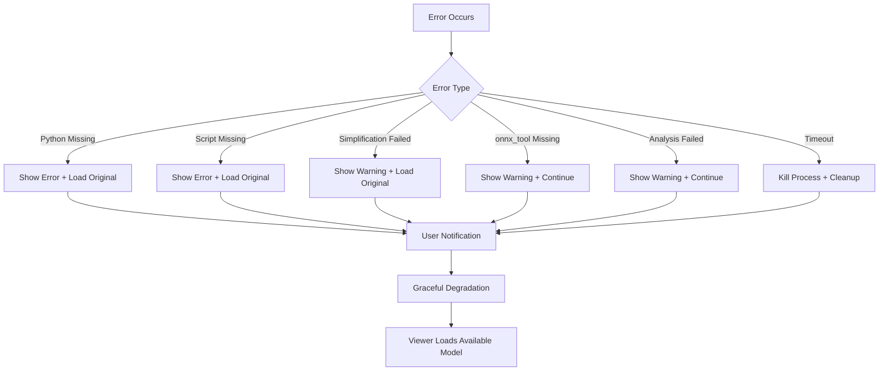

# QTron Architecture & Data Flow Diagram

## System Architecture



## Data Flow Diagram



## Component Relationships

### Extension Layer
```
src/
├── extension.ts           # Entry point, extension activation
├── onnx_viewer.ts         # Main document provider, orchestrates processing
└── onnx3.ts              # Protocol buffer definitions
```

### Processing Layer
```
scripts/
├── simplify_onnx.py                    # Main processing script
└── onnx-tool-experiment/
    └── workflow/
        ├── onnx_prof.py                 # Original profiling function
        └── onnx_prof_configurable.py   # Enhanced configurable version
```

### Viewer Layer
```
onnx_view/
├── main.js               # WebView entry point
├── onnx_view.js          # Main visualization logic
├── onnx_model.js         # Model rendering
└── grapher.js            # Graph layout and interaction
```

### Model Layer
```
onnx_model/
├── onnx_model.js         # ONNX model abstraction
└── onnx_metadata.js      # Operator metadata and definitions
```

## Configuration Flow

```
User Settings (VS Code)
         ↓
    Configuration Reader
         ↓
┌─────────────────────┐
│ Processing Options  │
├─────────────────────┤
│ • enableSimplification
│ • enableOnnxToolProfiling  
│ • onnxToolResultsPath
│ • pythonPath
└─────────────────────┘
         ↓
    Script Parameters
         ↓
    Python Execution
```

## Error Handling Architecture



## File Processing Pipeline

### Input Processing
1. **Original ONNX File** → Read by extension
2. **Temporary Copy** → Created for processing
3. **Configuration** → Applied to processing parameters

### Transformation Steps
1. **onnxsim Simplification** → Optimize model structure
2. **onnx_tool Analysis** → Generate performance metrics
3. **Report Generation** → Create text/CSV outputs
4. **Shape Extraction** → Create shape-only model

### Output Generation
1. **Simplified Model** → For visualization
2. **Analysis Reports** → For performance review
3. **Shape Model** → For structure analysis
4. **User Feedback** → Status and result notifications

## Integration Points

### VS Code Integration
- **Custom Editor Provider** → Handles .onnx file association
- **Configuration System** → User settings management
- **Output Channel** → Status and logging
- **Notification System** → User feedback

### Python Integration
- **execFile()** → Secure script execution
- **Parameter Passing** → Configuration to scripts
- **Error Capture** → stdout/stderr handling
- **Timeout Management** → Process lifecycle

### File System Integration
- **Temporary Files** → Safe processing workspace
- **Results Directory** → Organized output storage
- **Cleanup Logic** → Resource management
- **Path Resolution** → Cross-platform compatibility

This architecture ensures a robust, maintainable, and user-friendly integration of onnx_tool capabilities within the QTron ONNX viewer.
